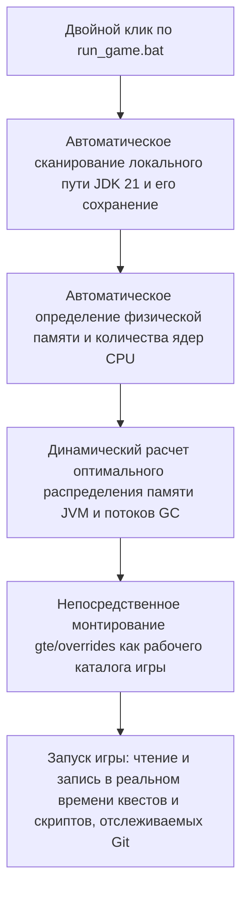

# Локальная горячая отладка и быстрый запуск без лаунчера

GTE разработала систему бесшовной отладки, чрезвычайно удобную для планировщиков модпаков, авторов заданий и программистов модов.

---

## ⚡ 1. Сценарий быстрого запуска без лаунчера (`run_game.bat` / `run_game.sh`)

Для авторов квестов (FTB Quests) и планировщиков рецептов KubeJS **не нужно открывать IntelliJ IDEA или устанавливать сторонние лаунчеры** — просто дважды щелкните **`run_game.bat`** в корне проекта, чтобы быстро войти в игру!



### Основные возможности

1. **Полностью автоматическое обнаружение JDK 21**: автоматически ищет Java 21, установленную в `.jdks`, `Adoptium`, `Zulu`, `Program Files`, и запоминает путь в `.jdk_path`.
2. **Адаптивная оптимизация под оборудование**: автоматически выделяет размер кучи JVM в оптимальной пропорции (50–60% доступной физической памяти) в зависимости от общего объема ОЗУ, автоматически настраивает параллельные потоки GC.
3. **Рабочий процесс без перемещений**: изменяйте задания в игре (`/ftbquests editing_mode true`) и сохраняйте — изменения сразу сохраняются в реальном времени в `config/ftbquests/` в репозитории Git, откройте GitHub Desktop и отправьте одним кликом!

---

## 🔗 2. Инструмент сопоставления без копирования для внешних лаунчеров (`link_to_launcher.bat`)

Если вы привыкли использовать лаунчер с настроенными скинами и раскладкой клавиш (например, PCL2 / HMCL / Prism Launcher):

1. Дважды щелкните **`link_to_launcher.bat`** в корне проекта.
2. Следуя подсказкам, перетащите каталог игры вашего лаунчера (например, `D:\PCL2\.minecraft\versions\GTE-Dev\.minecraft\`) в консоль и нажмите Enter.
3. Скрипт автоматически создаст символические ссылки на каталоги Windows (Directory Junctions):
   - `config` ➜ `gte/overrides/config`
   - `kubejs` ➜ `gte/overrides/kubejs`
   - `ftbquests` ➜ `gte/overrides/config/ftbquests`
   - `defaultconfigs` ➜ `gte/overrides/defaultconfigs`
4. Независимо от того, как вы изменяете задания или рецепты в лаунчере, **физические данные синхронизируются в реальном времени и сохраняются в основном репозитории Git**!

---

## ☕ 3. Теневая среда горячей компиляции кода модов (`gte-dev-runtime`)

Для программистов Java/Kotlin `modules/gte-dev-runtime` — это специальный модуль теневой отладки:

### Принцип работы и проектные соображения

- **Назначение**: чисто локальная песочница для горячей компиляции и отладки, **запрещено упаковывать и публиковать, не будет включено ни в какие сборки для игроков**.
- **Динамическое ремаппинг ModDevGradle**: автоматически компилирует последние исходники `gtm-reborn` и `gtecore` и подключает их в пространство имен деобфускации Mojang.
- **Способы запуска**:
  - В IDEA выберите конфигурацию запуска **`Run GTE Full Pack (Client - Hot Debug)`**.
  - Или выполните в командной строке:
    ```powershell
    .\gradlew.bat :modules:gte-dev-runtime:runClient
    ```