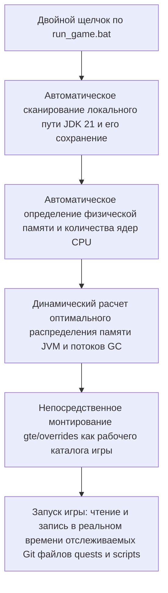

# Локальная горячая отладка и быстрый запуск без лаунчера

GTE разработала систему бесшовной отладки, чрезвычайно удобную для планировщиков модпаков, авторов заданий и программистов модов.

---

## ⚡ 1. Сценарий быстрого запуска без лаунчера (`run_game.bat` / `run_game.sh`)

Для авторов заданий (FTB Quests) и планировщиков рецептов KubeJS **не нужно открывать IntelliJ IDEA или устанавливать сторонние лаунчеры** — просто дважды щелкните **`run_game.bat`** в корне проекта, чтобы быстро войти в игру!



### Основные возможности
1. **Полностью автоматическое обнаружение JDK 21**: автоматически ищет установленные Java 21 в `.jdks`, `Adoptium`, `Zulu`, `Program Files` и запоминает путь в `.jdk_path`.
2. **Адаптивная оптимизация под оборудование**: автоматически выделяет размер кучи JVM в оптимальной пропорции (50–60% доступной физической памяти) на основе общего объема RAM компьютера и автоматически настраивает параллельные потоки GC.
3. **Рабочий процесс без перемещения файлов**: изменения заданий в игре (команда `/ftbquests editing_mode true`) и их сохранение напрямую сохраняются в реальном времени в соответствующей папке `config/ftbquests/` в Git-репозитории. Откройте GitHub Desktop и отправьте изменения одним кликом!

---

## 🔗 2. Инструмент сопоставления без копирования для внешних лаунчеров (`link_to_launcher.bat`)

Если вы привыкли использовать лаунчер с настроенными скинами и раскладкой клавиш (например, PCL2 / HMCL / Prism Launcher):

1. Дважды щелкните **`link_to_launcher.bat`** в корне проекта.
2. Следуя подсказкам, перетащите игровой каталог вашего лаунчера (например, `D:\PCL2\.minecraft\versions\GTE-Dev\.minecraft\`) в консоль и нажмите Enter.
3. Скрипт автоматически создаст символические ссылки на каталоги Windows (Directory Junctions):
   - `config` ➜ `gte/overrides/config`
   - `kubejs` ➜ `gte/overrides/kubejs`
   - `ftbquests` ➜ `gte/overrides/config/ftbquests`
   - `defaultconfigs` ➜ `gte/overrides/defaultconfigs`
4. Независимо от того, как вы изменяете задания или рецепты в лаунчере, **физические данные синхронизируются и сохраняются в реальном времени в основном Git-репозитории**!

---

## ☕ 3. Теневая среда горячей компиляции кода модов (`gte-dev-runtime`)

Для программистов на Java/Kotlin `modules/gte-dev-runtime` — это специальный теневой отладочный модуль:

### Принцип работы и проектные соображения
- **Назначение**: чисто локальная песочница для горячей компиляции и отладки, **запрещено упаковывать и публиковать, не будет включено ни в какие сборки для игроков**.
- **Динамическое ремаппинг ModDevGradle**: автоматически горячо компилирует последние исходники `gtm-reborn` и `gtecore` и подключает их в пространство имен деобфускации Mojang.

### Правильный способ запуска

Эти три точки входа равнозначны, и все они автоматически выводят окно игры на передний план:

```powershell
$env:JAVA_HOME='C:\Users\Ex_Je\.jdks\ms-21.0.11'
.\gradlew.bat runFullPack                          # preferred, root aggregate entry point
.\gradlew.bat :modules:gte-dev-runtime:runClient    # equivalent
.\run_game.bat                                     # same task, auto-detects JDK/RAM/cores
```

### Почему в первые 25 секунд окно не появляется (это нормально)

Раннее окно прогресса Forge намеренно отключено, чтобы избежать взаимной блокировки контекста GLFW в Embeddium/Oculus на дискретных GPU. Плата за это — окно создаётся только внутри `Minecraft.<init>`, а к этому моменту JVM игры уже является фоновым процессом, порождённым (fork) демоном Gradle. Блокировка переднего плана Windows отклоняет его запрос на фокус, поэтому окно создаётся и отрисовывается корректно, но оказывается под активным окном — что выглядит в точности как «окно так и не появилось».

Поэтому `runClient` асинхронно запускает `scripts/dev/raise_game_window.ps1`. Скрипт опрашивает систему в поисках окна `GLFW30`, принадлежащего JVM именно этого запуска, и поднимает его с помощью `SetWindowPos` (изменения Z-порядка не подпадают под блокировку переднего плана, поэтому поднятие окна всегда срабатывает). Его журнал находится в `modules/gte-dev-runtime/build/raise-game-window.log`. Полный «холодный» запуск занимает около 70 секунд.

### Переменные окружения

| Переменная окружения | Действие |
| --- | --- |
| `GTE_WINDOW_WIDTH` / `GTE_WINDOW_HEIGHT` | Размер окна (по умолчанию 1600x900) |
| `GTE_NO_WINDOW_RAISE=1` | Не поднимать окно, оставить его там, куда его поместил GLFW |
| `GTE_RUNTIME_XMX` | Предел кучи клиента (по умолчанию `8G`) |

### Не запускайте через `.vscode/launch.json`

Конфигурации в `.vscode/launch.json` автоматически генерируются ModDevGradle при синхронизации IDE. Они напрямую вызывают `net.neoforged.devlaunch.Main`, обходя задачу `runClient`, поэтому окно никогда не поднимается — к тому же файл перезаписывается при каждой синхронизации IDE, так что ручные правки не сохраняются. Постоянные аргументы запуска указывайте в блоке `runs {}` файла `build.gradle`.

Когда нужны точки останова, используйте конфигурацию IntelliJ `Run Client (Hot Debug)`. Она подключает отладчик JDWP и при выходе может оставлять файлы `hs_err_pid*.log` в `run/client/`; это известный безвредный артефакт, не связанный с процессом запуска.