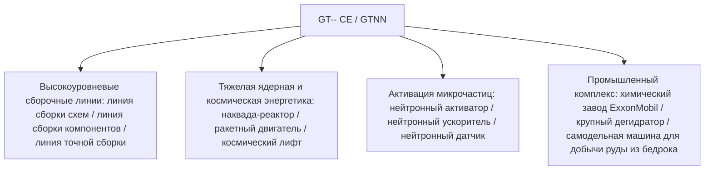

# GT-- Community Edition (GTNN)

`modules/gt--` (пакет `dev.arbor.gtnn`) — это официальный мод сообщества GT-- Community Edition, построенный на гибридной архитектуре **Kotlin + Java** (ветка разработки: `kotlin`).

---

## 🏗️ Архитектура и технологический стек

- **Язык разработки**: Kotlin 2.0.21 + Java 21.
- **Направленность**: включает в себя любимые игроками гигантские сборочные линии, тяжелые ядерные реакторы, системы дегидраторов и космическую промышленность из классического GT 5.09 и современных расширений.



---

## 🏭 Основные мультиблочные машины и устройства

### 1. Сборочные конвейерные линии
- **Линия сборки схем (`circuit_assembly_line`)**: предназначена для эффективного массового производства чипов среднего и высокого уровня и сложных схем, поддерживает многоуровневые прецизионные корпуса.
- **Линия сборки компонентов (`component_assembly_line`)**: использует корпуса соответствующего уровня в зависимости от напряжения (от LV до MAX), массово собирает основные двигатели и датчики.
- **Линия точной сборки (`precision_assembly_line`)**: производит нанометровые фотолитографические маски и шины суперкомпьютеров с высочайшей точностью.

### 2. Системы ускорения частиц и нейтронной активации
- **Нейтронный активатор (`neutron_activator`)** и **нейтронный ускоритель (`neutron_accelerator`)**:
  - Моделируют реакции высокоэнергетических коллайдеров и захвата быстрых нейтронов, активируя обычные стабильные изотопы в радиоактивные тяжелые ядерные материалы или сверхтяжелые сверхпроводящие элементы.
- **Нейтронный датчик (`neutron_sensor`)**: в реальном времени обнаруживает поток кинетической энергии нейтронов в реакционной камере, обеспечивает обратную связь через редстоун или компьютерный сигнал.

### 3. Тяжелая ядерная энергетика и космическая промышленность
- **Большой наквада-реактор (`large_naquadah_reactor`)**: работает на наквада-сплавах и обогащенном топливе, обеспечивает стабильный выход энергии EU высокой плотности.
- **Ракетный двигатель (`rocket_engine`)**: потребляет высококачественное ракетное топливо, обеспечивает импульсную мощность для высоконагруженного оборудования.
- **Космический лифт (`space_elevator`)**: соединяет с низкой околоземной орбитой, обеспечивает добычу космических минералов и производство в условиях микрогравитации.

### 4. Химические и горнодобывающие комплексы
- **Химический завод ExxonMobil (`exxonmobil_chemical_plant`)**: сверхбольшая установка глубокой переработки нефти, выполняющая все процессы крекинга, риформинга, ароматизации и полимеризации в одной машине.
- **Большой дегидратор (`large_dehydrator`)**: эффективно удаляет кристаллизационную и свободную воду из жидкостей или химических минералов.
- **Самодельная машина для добычи руды из бедрока (`homemade_bedrock_ore_machine`)**: развертывает самодельные буры в слое бедрока, непрерывно извлекая бесконечные глубокие рудные жилы.

---

## 🌿 Правила рабочего процесса Git для подмодуля

`modules/gt--` соответствует отдельному Git-репозиторию `takanashisatou/GT---Community-Edition`, ветка разработки: `kotlin`:

```bash
# Разработка и коммиты в подмодуле независимо
cd modules/gt--
git checkout kotlin
git add .
git commit -m "feat: add precision assembly line recipes"
git push origin kotlin

# Возврат в основной проект и обновление указателя подмодуля
cd ../..
git add modules/gt--
git commit -m "chore: bump gt-- submodule pointer"
```