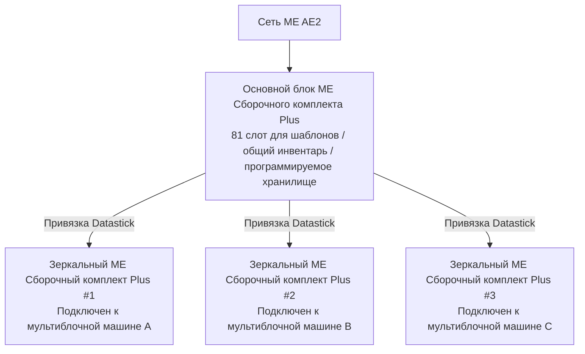

# Система глубокой интеграции AE2 и сборочного комплекта Plus

GTECore создает чрезвычайно мощный прямой мост данных между Applied Energistics 2 (AE2) и мультиблочными структурами GregTech.

---

## 🧩 ME Сборочный комплект Plus (`me_pattern_buffer_plus`)

В традиционных технических модах подключение сборочного комплекта AE2 к мультиблочным машинам обычно сталкивается с такими проблемами, как **недостаточное количество слотов, невозможность смешанного вывода жидкостей и предметов, а также сложность совместного использования шаблонов несколькими машинами**.

Разработанный GTECore **ME Сборочный комплект Plus** полностью решает эту проблему:

### Основные возможности
1. **Огромная емкость шаблонов**: Один основной комплект имеет **81 слот для шаблонов** (эквивалент суммы 9 стандартных сборочных комплектов AE2).
2. **Универсальные возможности отсеков**: Одновременно поддерживает `IMPORT_ITEMS`, `IMPORT_FLUIDS`, `EXPORT_ITEMS`, `EXPORT_FLUIDS`, что позволяет смешанное взаимодействие жидкостей и предметов в одном отсеке.
3. **Поддержка программируемого хранилища**: Встроенный механизм Programmable Storage обеспечивает точную подачу и кэширование для сложных рецептов.

---

## 🪞 Зеркальный ME Сборочный комплект Plus (`me_pattern_buffer_proxy_plus`)

**Зеркальный Сборочный комплект Plus** — это революционный распределенный компонент автоматизации:

### Принцип работы и совместное использование между машинами
- Установите зеркальный комплект в отсек любой мультиблочной машины.
- Держа **Datastick** в руке, щелкните правой кнопкой мыши по основному **ME Сборочному комплекту Plus**, чтобы считать координаты, затем щелкните правой кнопкой мыши по **Зеркальному Сборочному комплекту Plus** для привязки.
- **Все привязанные зеркальные комплекты будут в реальном времени разделять все 81 шаблон, размещенные в основном комплекте**!
- Когда сеть AE2 запускает задачу автоматического синтеза, сеть автоматически распределяет нагрузку между всеми свободными зеркальными машинами для параллельной работы!

### Отображение состояния в Jade
При наведении на сборочный комплект или зеркальный комплект Jade автоматически отображает:
- Основной комплект: `Количество подключенных зеркал: X`
- Зеркальный компонент: `Привязан к - X: ..., Y: ..., Z: ...`

---

## 💨 ME Паровой отсек (`me_steam_hatch`)

- **Функция**: Прямое подключение сети жидкостей AE2 к паровой мультиблочной структуре.
- **Назначение**: Паровой мультиблочной структуре больше не требуются внешние сложные высокоскоростные паровые трубы и резервуары; она может напрямую извлекать пар из сети ME с максимальной пропускной способностью для питания, устраняя узкие места в трубопроводной передаче.