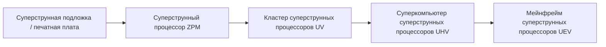
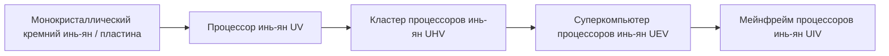

# Суперструнные и инь-ян высокоуровневые схемы и материальные системы

GTECore расширяет две высокоуровневые ветви схем, охватывающие весь цикл от ZPM до MAX — **систему суперструнных схем** и **систему инь-ян тайцзи схем**, а также с помощью центра комплексной обработки руды реализует автоматический цикл материалов.

---

## 🌌 Система суперструнных схем (Super String Circuitry)

Суперструнные схемы получают сверхсветовую вычислительную мощность из высокоразмерных колеблющихся струн, охватывая в основном градиент напряжения **ZPM ➜ UEV**:

### Суперструнные материалы и струнные вещества
- **Струна происхождения (`item.gtecore.original_string`)**：источник колебаний высокоразмерной вселенной.
- **α-струна / β-струна / γ-струна (`alpha_string`, `beta_string`, `gamma_string`)**：суперструнные полимеры с различными энергетическими уровнями и поляризационными состояниями.
- **Смеситель суперструн (`super_string_mixer`)**、**Струна творения (`string_of_creation`)** и **Осцилляторная решётка суперструн (`super_string_oscillator_array`)**：используются для расщепления, настройки и высокоуровневой фиксации суперструнных материалов.

---

## ☯️ Система инь-ян тайцзи схем (Yin-Yang Circuitry)

Система инь-ян схем следует философии циклического взаимопорождения **“инь рождает ян, ян рождает инь, бесконечное продолжение”**, охватывая **UV ➜ UIV** и даже более высокие пределы:

### Специальные талисманы восьми триграмм и пяти элементов
- **Пять элементов**：элемент металла (`jinyuansu`)、элемент дерева (`muyuansu`)、элемент воды (`shuiyuansu`)、элемент огня (`huo`)、элемент земли (`tuyuansu`).
- **Талисманы пяти элементов**：талисман металла, талисман дерева, талисман воды, талисман огня, талисман земли.
- **Символы и чипы восьми триграмм**：камни-символы и основные чипы восьми триграмм — Цянь, Кунь, Чжэнь, Сюнь, Кань, Ли, Гэнь, Дуй.
- **Частица трёх чистых (`god_nugget`)**：высококлассный синтетический медиатор, конденсирующий энергию неба и земли.

---

## 💎 Рецептурные режимы центра комплексной обработки руды

**Центр комплексной обработки руды (`ore_process_center`)** имеет 7 стандартных режимов схем, которые можно переключать, устанавливая номер программируемой схемы в машине:

| Номер схемы | Технологический маршрут | Типы применимых руд и особенности продукции | Коэффициент выхода |
| :---: | :--- | :--- | :---: |
| **Схема 1** | Дробление ➜ Дробление ➜ Промывка | Быстрое массовое производство основных металлических руд (железо, медь, олово и т.д.) | 5x основной продукт + побочные продукты |
| **Схема 2** | Дробление ➜ Дробление ➜ Центрифугирование | Сопутствующие высокоценные редкие лёгкие металлические руды | 5x основной продукт + очищенные центрифугированием побочные продукты |
| **Схема 3** | Дробление ➜ Промывка ➜ Термическое разделение ➜ Дробление | Высокотемпературные огнеупорные руды, руды благородных металлов (платиновая группа, золото, серебро и т.д.) | 5~6x + чистый металлический порошок |
| **Схема 4** | Дробление ➜ Термическое разделение ➜ Дробление | Сульфидные и сильно сложные вкраплённые руды | 5x + специальные побочные продукты термического разделения |
| **Схема 5** | Дробление ➜ Промывка ➜ Дробление ➜ Промывка | Редкоземельные руды и многостадийные растворимые соляные руды | 6x + двойные побочные продукты промывки |
| **Схема 6** | Дробление ➜ Промывка ➜ Дробление ➜ Центрифугирование | Радиоактивные тяжёлые руды (уран, торий, плутоний) и редкоземельные | 6x + тонко очищенные центрифугированием тяжёлые металлы |
| **Схема 8** | Дробление ➜ Промывка ➜ Дробление ➜ Электромагнитное обогащение | Сильномагнитные и парамагнитные минералы (магнетит, хром, титан и т.д.) | 6~8x + электромагнитный чистый порошок |