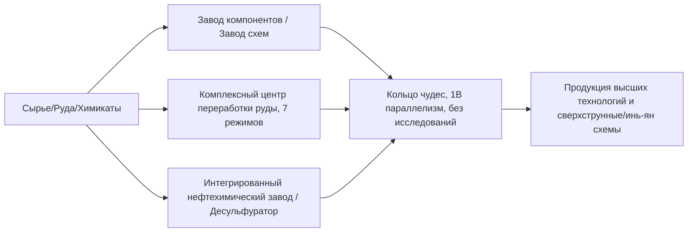

# GTECore Справочник по мультиблочным машинам

GTECore разработан для решения проблем громоздких технологических цепочек в середине и конце технической линии, предлагая множество мультиблочных машин с **высочайшим параллелизмом** и **агрегированной логикой производства**.

---

## 🏭 Крупные мультиблоки паровой эпохи

Чтобы решить проблемы низкой производительности и избыточной занимаемой площади одиночных машин в паровой эпохе, GTECore представляет серию крупных паровых мультиблоков, все из которых поддерживают кросс-рецептурный параллелизм и высокую пропускную способность пара:

| Название машины (Block ID) | Основная функция и типы рецептов | Особенности и преимущества |
| :--- | :--- | :--- |
| **Большая паровая сплавочная печь** (`gtceu:big_alloy`) | Выплавка сплавов (`alloy_smelter`) | Высокопроизводительное производство сплавов на ранних этапах, поддержка пара высокого давления |
| **Большой паровой компрессор** (`gtceu:big_compressor`) | Обработка сжатием (`compressor`) | Массовое прессование плотных металлических пластин и блоков |
| **Большой паровой ковочный молот** (`gtceu:big_forge_hammer`) | Ковка/дробление в порошок/пластины (`forge_hammer`) | Автоматизированное быстрое дробление пластин и сырой руды |
| **Большой паровой экстрактор** (`gtceu:big_steam_extractor`) | Экстракция каучука/жидкостей (`extractor`) | Масштабная экстракция древесной смолы и промышленных жидкостей |
| **Простая паровая дробилка** (`gtceu:steam_grinder_easy`) | Измельчение руды (`macerator`) | Многократная переработка минералов на ранних этапах |
| **Простая паровая печь** (`gtceu:steam_oven_easy`) | Пиролизная плавка (`pyrochlore_oven`) | Промышленное массовое производство кокса и древесного угля |
| **Паровой завод по переработке руды** (`gtecore:steam_op`) | Комплексное дробление и очистка руды | **Параллелизм 1 миллиард (1B)**, все рецепты выполняются за **1 тик**! Поддержка любых входных/выходных отсеков |

---

## ⚡ Суперэлектрические промышленные мультиблоки

С наступлением электрической эпохи GTECore предлагает многофункциональные и высокоуровневые обрабатывающие центры:

### 1. Основные производственные заводы

- **§6 Завод компонентов (`gtceu:component_factory`)**:
  - **Назначение**: производство двигателей, насосов, поршней, манипуляторов, конвейерных лент, светодиодов и других распространенных базовых компонентов за один шаг.
  - **Особенности**: пропуск сложных промежуточных подпроцессов, мгновенное производство стандартных промышленных деталей заданного уровня напряжения.
- **§6 Завод схем (`gtceu:circuit_factory`)**:
  - **Назначение**: объединение производства интегральных схем, травления чипов и интегральной упаковки.
  - **Особенности**: поддержка кросс-рецептурных параллельных отсеков, полное ускорение производства плат от ULV до MAX по всей шкале напряжений.
- **§6 Кольцо чудес (`gtceu:miracle_ring`)**:
  - **Назначение**: конечное сборочное сооружение промышленных чудес.
  - **Особенности**: **параллелизм 1 миллиард (1B)** и **разгон 1t Subtick**, **не требует никаких исследований/исследований сборочных линий** для выполнения рецептов сборочной линии!
- **Химический терминатор (`gtecore:chemistry_terminator`)**:
  - **Назначение**: «ниспровергает существование химии и физики, олицетворяет конец химии».
  - **Особенности**: объединяет сложные многоступенчатые химические реакции в один шаг, мгновенно синтезируя различные конечные полимеры и кислотные среды.
- **Универсальный завод десяти в одном (`gtecore:ten_in_one`)**:
  - **Назначение**: универсальный интегрированный блок, объединяющий 10 основных процессов: центрифугирование, электролиз, химическое выщелачивание, полимеризацию, реакции под высоким давлением и другие.

### 2. Система очистки руды и жидкостей

- **§6 Комплексный центр переработки руды (`gtecore:ore_process_center`)**:
  - Поддержка **7 режимов программируемых схем**, обеспечивающих 5–8-кратную очистку минералов с различными целевыми продуктами (дробление, промывка, термическое разделение, центрифугирование, электромагнитная сепарация — все интегрировано), поддержка разгона 1t Subtick.
- **Интегрированный нефтехимический завод (`gtecore:integrated_petrochemical_plant`)**:
  - Объединяет фракционирование сырой нефти, каталитический крекинг, риформинг и десульфурацию в единую цепочку, производя все легкие углеводородные газы и ароматические углеводороды в одной машине.
- **Десульфуратор (`gtceu:desulfurization`)**:
  - Быстрая очистка различных тяжелых сернистых топлив, извлечение высокочистого порошка серы в качестве побочного продукта.
- **Простая/продвинутая буровая установка для жидкостей (`gtecore:easy_fluid_drilling_rig` / `not_hard_fluid_drilling_rig`)**:
  - Автоматическая добыча жидких руд из коренной породы, никогда не истощается, не требует сложной разведки трубопроводов.

### 3. Высокотехнологичная и сверхпроводящая обработка кабелей

- **§6 Завод проводов (`gtecore:wiremill_factory`)**: производство всех металлических проводов (одинарных, двойных, четверных, восьмерных, шестнадцатерных) и сверхпроводящих кабелей одним нажатием.
- **§6 Кристаллический центр (`gtecore:crystal_center`)**: масштабное автоматическое выращивание монокристаллических кремниевых стержней, изумрудов, сапфиров, заряженных кристаллов Секстэля.
- **§6 Квантовый кабельный сборщик (`gtecore:quantum_cable_assembler`)**: специально для высокоскоростного производства квантовых оптоволоконных и сверхмерных энергетических кабелей.
- **§3 Звездный клинок для травления (`gtecore:starblade_etching_machine`)**: использование высокоэнергетических пучков в экстремальном ультрафиолетовом/рентгеновском диапазоне для травления галактических микрочипов.

---

## 🔋 Энергетика и генераторные системы

| Название машины | Выход энергии/уровень | Основной механизм и особенности |
| :--- | :--- | :--- |
| **§6 Универсальный топливный двигатель** (`gtceu:general_fuel_engine`) | Динамическая адаптация (до MAX) | **Поддерживает все типы топлива в мире** (дизель, биомасса, природный газ, ракетное топливо и т.д.), **параллелизм 2 миллиарда (2B)**, мгновенное выделение огромного количества энергии! |
| **Большой универсальный генератор** (`gtecore:large_general_generator`) | Многоуровневое напряжение на выбор | Совместим с обычными газовыми, паровыми и плазменными роторами генераторов |
| **Супертермоядерный реактор** (`gtecore:super_fusion_reactor`) | Выход термоядерной плазмы | Полностью устраняет длительное ожидание нагрева обычного термоядерного синтеза, **идеальная поддержка разгона 1T Subtick**, мгновенный выход высокотемпературных продуктов синтеза |
| **Супербатарейный буфер с максимальным напряжением** (`gtecore:max_super_battery_buffer_1x`) | **MAX (2,147,483,647 В)** | Вмещает огромный запас EU, поддержка беспроводного интерфейса зарядки через измерения с нулевыми потерями |