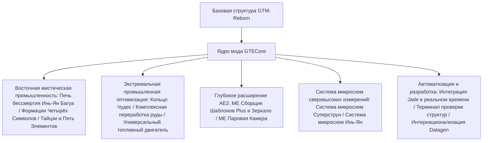

# Обзор ядра мода GTECore

**GTECore** — это кастомное Java-ядро мода для проекта GregTech Easy. Оно напрямую зависит от исходного кода `gtm-reborn` и расширяет его масштабными многоблочными промышленными структурами, высокоуровневыми технологиями формаций, глубоким взаимодействием с AE2 и супер-системой производства микросхем.

---

## 🏛️ Архитектура мода и дизайн-позиционирование

---

## 📦 Вкладка творческого режима и категории

GTECore регистрирует отдельную вкладку творческого режима в игре:

1. **Машины GregTech Easy (`itemGroup.gtecore.gtecore_machines`)**:
   - Содержит все оригинальные многоблочные контроллеры GTE (Печь бессмертия Инь-Ян Багуа, Кольцо Чудес, Центр переработки руды, Химический Терминатор и т.д.).
   - Содержит многоуровневые супер-батарейные блоки (Max Super Battery Buffer), ME Паровую Камеру, ME Сборщик Шаблонов Plus и Зеркало.
2. **Предметы GregTech Easy (`itemGroup.gtecore.gtecore_items`)**:
   - Содержит предметы серии микросхем Суперструн и Инь-Ян (процессоры, кластеры, суперкомпьютеры, главные вычислители).
   - Содержит специализированные предметы: талисманы Пяти Элементов, чипы Восьми Триграмм, частицы Саньцин, терминал проверки структур и т.д.

---

## ⚙️ Глобальная конфигурация мода (`GTEConfig`)

GTECore предоставляет множество опций конфигурации в игре и в файлах (расположены в `config/gtecore-common.toml` или в меню конфигурации в игре):

| Параметр | Значение по умолчанию | Подробное описание |
| :--- | :--- | :--- |
| `superPeace` (Режим супер-мира) | `false` | При включении полностью отключает генерацию враждебных мобов, обеспечивая абсолютно чистую среду для технологического строительства |
| `durationMultiplier` (Множитель времени рецептов) | `1.0` | Глобально регулирует множитель времени для пользовательских рецептов GTECore |

---

## 🔍 Нативная интеграция Jade / TOP

GTECore имеет встроенную поддержку плагина **`GTEJadePlugin`**:
- **Статус ME Сборщика Шаблонов Plus**: отображает в реальном времени количество привязанных шаблонов, режимы вывода жидкостей и предметов текущего сборщика.
- **Информация о привязке Зеркала ME Сборщика Шаблонов Plus**: при наведении напрямую отображает координаты `(X, Y, Z)` привязанного основного сборщика и статус сетевого подключения.
- **Индикация активации формации**: на Печи бессмертия Инь-Ян Багуа в реальном времени отображает статус готовности формаций Четырёх Символов: Лазурного Дракона, Белого Тигра, Багровой Птицы и Чёрной Черепахи.

---

## 🛠️ Терминал проверки структур (`Structure Testing Terminal`)

GTECore предоставляет эксклюзивный ручной инструмент — **Терминал проверки структур** (`item.gtecore.check_structure_terminal`):
- **ПКМ по много блочному контроллеру**: сканирование целостности структуры в реальном времени.
- **Подсказки по диагностике ошибок**: если структура не сформирована, терминал точно укажет в чате и всплывающей подсказке **координаты ошибочных блоков и места, которые не должны быть заняты**, что значительно ускоряет строительство и устранение неполадок больших много блочных структур.