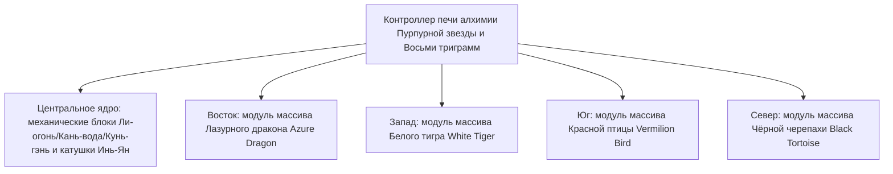

# Система печи алхимии Инь-Ян и Восьми триграмм и массив Четырёх Символов

GTECore представляет уникальную **систему Тайцзи, Восьми триграмм и Четырёх Символов**, сочетающую восточную даосскую философию с современной тяжёлой промышленной инженерией. Эта система является центральным узлом металлургии, синтеза сверхпроводящих материалов и технологического скачка в бессмертные технологии на средней и поздней стадиях игры.

---

## 🌌 Печь алхимии Инь-Ян и Восьми триграмм (`yin_yang_eight_trigmas_blast_furnace`)

**Печь алхимии Пурпурной звезды и Восьми триграмм** — одна из самых масштабных и точных многоструктурных конструкций в мире модов на технику (занимает более 55×55 блоков):



### 🧭 Правило ориентации по фэн-шуй (ключевой механизм)
> [!IMPORTANT]
> **Закон方位 фэн-шуй**: Из-за ограничений фэн-шуй и магнитного поля **главный контроллер печи алхимии должен быть размещён лицевой стороной строго на юг**, чтобы соединиться с энергией Инь-Ян неба и земли и корректно сформироваться и работать!

### Базовые возможности корпуса печи
- **Поддержка библиотеки рецептов**: Нативно совместим с обычными рецептами доменной печи (`blast_recipes`), рецептами плавильной печи (`furnace_recipes`), рецептами сплавной печи (`alloy_smelter_recipes`), рецептами гигантской сплавной доменной печи GCYM (`alloy_blast_recipes`) и эксклюзивными **рецептами Инь-Ян и Восьми триграмм (`yin_yang_eight_trigmas_blast`)**.
- **Особенности разгона**: Полная поддержка **мгновенного разгона 1T Subtick** и **пакетного режима (Batch Mode)**.

---

## 🐉 Подмодули массива Четырёх Символов и динамическое обнаружение условий

Вокруг печи алхимии можно расширить четыре крыла массива: **Восточный Лазурный дракон, Западный Белый тигр, Южная Красная птица, Северная Чёрная черепаха**:

| Модуль массива | Направление массива | Блоки массива | Условие рецепта (`RecipeCondition`) | Бонусы и эффекты при активации |
| :--- | :--- | :--- | :--- | :--- |
| **Массив Лазурного дракона** (`Qing Long`) | **Восток (East)** | `qinglong_module` | `QING_LONG_CONDITION` | Активирует силу дерева, порождающего огонь, значительно снижает энергопотребление при сверхвысокотемпературной плавке, открывает бесконечные высокоуровневые каталитические рецепты |
| **Массив Белого тигра** (`Bai Hu`) | **Запад (West)** | `baihu_module` | `BAI_HU_CONDITION` | Металлическая губительная сила, открывает рецепты расщепления сверхтвёрдых божественных металлов, сверхплотных тяжёлых ядерных элементов и квантового металлического превращения |
| **Массив Красной птицы** (`Zhu Que`) | **Юг (South)** | `zhuque_module` | `ZHU_QUE_CONDITION` | Южный свет огня, обеспечивает неограниченную максимальную температуру печи, открывает рецепты звёздного плазменного литья и алхимии божественных пилюль |
| **Массив Чёрной черепахи** (`Xuan Wu`) | **Север (North)** | `xuanwu_module` | `XUAN_WU_CONDITION` | Вода Кань охраняет, сверхбыстрое охлаждение сверхвысокотемпературных продуктов, открывает рецепты мгновенного затвердевания и стабилизации антиматерии |

### Динамическое обнаружение и обратная связь состояния
- При каждом сканировании структуры и сопоставлении рецептов контроллер автоматически вызывает `checkModule()` для проверки готовности блоков массива на четырёх смещённых координатах.
- При наведении на контроллер с помощью **Jade** можно наглядно увидеть текущее состояние активации четырёх массивов (зелёный — активирован, красный — не готов).

---

## 🔮 Производные ядра Дао и звёздная матрица

На основе печи алхимии Восьми триграмм GTECore дополнительно расширяет серию многоструктурных конструкций небесного Дао:

```
Промышленный кластер высокого уровня GTE
├── Массив разделения пяти элементов Тайцзи (Tai Chi Five Elements Separation Array)
├── Звёздный узел Кунь-гэнь (Kun Gen Star Hub)
├── Двигатель Цянь-цюн (Qian Qiong Engine)
├── Ядро Дао Красного солнца (Red Sun Tao Core)
└── Термоядерный массив Пепельной звезды (Ashing Star Fusion Array)
```

1. **Массив разделения пяти элементов Тайцзи (`taichi_five_elements_separation_array`)**:
   - Разделяет и анализирует любые минералы и химические вещества из реальности и фантазий на чистые первоэлементы **металла, дерева, воды, огня и земли**.
2. **Звёздный узел Кунь-гэнь (`kun_gen_star_hub`)**:
   - Связывает гравитационные волны земли и звёзд, используется для сбора микроскопических гравитонов и создания микроскопических чёрных дыр.
3. **Двигатель Цянь-цюн (`qian_qiong_engine`)**:
   - Двигатель, извлекающий энергию из пустоты, получает необъятную энергию вакуума из квантовых флуктуаций ничто.
4. **Ядро Дао Красного солнца (`red_sun_tao_core`)**:
   - Искусственное сверхминиатюрное звёздное ядро, моделирующее экстремальные физические условия триллионов градусов в короне звезды.
5. **Термоядерный массив Пепельной звезды (`ashing_star_fusion_array`)**:
   - Матрица аннигиляционного термоядерного синтеза остатков сверхновых, используется для восстановления баланса тёмной материи и антиматерии.