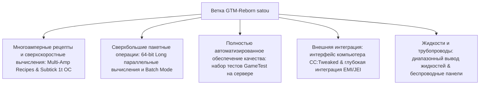

# GregTech Modern Reborn (GTM Reborn)

`modules/gtm-reborn` — это глубоко настроенная независимая ветвь GregTech Modern от GTE-Multi (ветка `satou`).

---

## 🚀 Ключевые улучшения ветки `satou`

По сравнению с оригинальной версией, GTM-Reborn в современной версии Minecraft 1.20.1 реализовал множество революционных технических усовершенствований и улучшений промышленного опыта:



### 1. 64-битные длинные целые параллельные вычисления и пакетный режим (Batch Mode)
- **Преодоление 32-битного целочисленного предела**: Параллельные вычисления полностью используют тип данных `long`, что полностью решает проблемы переполнения или усечения чисел в сверхбольших промышленных группах при очень высоком параллелизме.
- **Интеллектуальный пакетный режим**: Когда сырье очень обильно, машина может упаковывать сотни и тысячи мелких рецептов в один цикл выполнения, что значительно снижает нагрузку на тики сервера.

### 2. 1T Subtick мгновенный разгон (OC_PERFECT_SUBTICK)
- Оптимизирован конвейер выполнения Recipe Logic машин, что позволяет указанным продвинутым машинам выполнять несколько итераций рецептов за 1 тик, раскрывая чистый предел промышленного производства.

### 3. Многоамперный ввод и поддержка рецептов (Multi-Amp)
- Рецепты машин поддерживают потребление/вывод нескольких ампер (Amperes) на один рецепт, а интерфейсы EMI/JEI наглядно отображают значения многоамперности и подсказки по спецификациям проводов.

### 4. Диапазонный вывод жидкостей (Ranged Fluid Outputs)
- Позволяет высокоуровневым дистилляционным колоннам и химическим реакторам выводить жидкие продукты с диапазонным колебанием в зависимости от температуры и давления.

### 5. Современная интеграция периферии CC:Tweaked (ComputerCraft)
- Все стандартные машины открывают периферийные интерфейсы для ComputerCraft:
  - Запрос в реальном времени прогресса рецепта, оставшегося времени и текущего потребления EU/t.
  - Динамическое включение, приостановка машин или переключение режимов работы с помощью Lua-скриптов.

---

## 🧪 Автоматизированное тестирование и проверка GameTest

GTM-Reborn включает полный набор автоматизированных тестов GameTest нативно для Minecraft (находится в `src/test`):

```powershell
# Запуск автоматизированного серверного теста GameTest
$env:JAVA_HOME='C:\Users\Ex_Je\.jdks\ms-21.0.11'
.\gradlew.bat :modules:gtm-reborn:runGameTestServer
```

### Область покрытия тестами
- **Система Cover**: Тестирование пропускной способности и логики предотвращения утечек для жидкостных насосных панелей, панелей передачи предметов и панелей направления энергии.
- **Recipe Logic машин**: Тестирование многоамперности, пакетной обработки, параллельности между рецептами и вычислений разгона.
- **Формирование и вращение мультиблоков**: Проверка структуры различных корпусов и отсеков при разных ориентациях.

---

## 🌿 Правила рабочего процесса Git для подмодуля

`modules/gtm-reborn` соответствует отдельному Git-репозиторию `takanashisatou/GregTech-Modern-Reborn`, ветка разработки по умолчанию — `satou`:

```bash
# Разработка и коммиты в подмодуле независимо
cd modules/gtm-reborn
git checkout satou
git add .
git commit -m "feat: optimize multiblock recipe logic"
git push origin satou

# Возврат в основной проект и обновление указателя подмодуля
cd ../..
git add modules/gtm-reborn
git commit -m "chore: bump gtm-reborn submodule pointer"
```