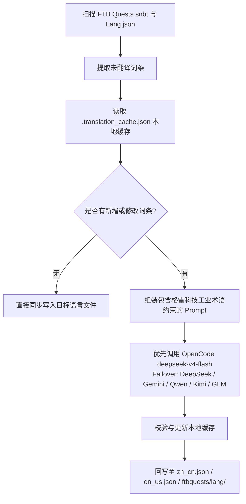

# AI 國際化翻譯引擎 (`opencode_translate.py`)

GTE 工程實現了由統一指令碼驅動的工業級多語言國際化翻譯體系，覆蓋 Mod 資產、FTB 任務書、Markdown 文件三大領域。

---

## 🔒 翻譯五條鐵律

本專案翻譯工作遵循以下 **5 條不可違反的鐵律**：

1. **單一指令碼**：所有翻譯唯一由 `scripts/opencode_translate.py` 驅動，接入 OpenCode Zen 的 `deepseek-v4-flash` 模型。禁止引入第二個翻譯指令碼或手動拼接 API 呼叫。
2. **雲端執行**：所有全量翻譯必須在 GitHub Actions CI 中執行（`translate.yml` / `docs-deploy.yml` / `sync-build.yml`），嚴禁在本地手動大規模執行。
3. **唯一定位**：全站統一部署到 `https://takanashisatou.github.io/GregtechEasy/`（`gh-pages` 分支），不搞第二個文件站，不重複部署。
4. **英文規則**：
   - 文件系統（`docs/en/`）：英文必須由 AI 全量翻譯自 `docs/zh/`，禁止人工覆蓋；
   - 模組工程：只有 `gtecore` 的 `en_us.json` 保持人工維護，指令碼內建保護邏輯，絕不機翻覆蓋。
5. **深度本地化**：導航選單（`nav_translations`）、Mermaid 流程圖文字、程式碼註釋、表格標籤必須 100% 對應語言本地化。

---

## 🤖 翻譯引擎架構

傳統的社群漢化依賴人工手動維護繁雜的 JSON 與 SNBT 文字，更新滯後且極易產生錯漏。

GTE 的 AI 翻譯引擎透過標準化 OpenAI 相容 API，實現了 FTB Quests 任務書與核心 Mod 語言檔案的**自動化增量提取、術語對齊與併發翻譯**：

---

## 🔑 支援的 LLM 供應商與環境變數

指令碼按以下優先順序自動選取第一個可用的 API Key，無需手動指定提供商：

| 優先順序 | 供應商名稱 | API Key 環境變數 | Base URL 環境變數 | 預設模型 |
| :---: | :--- | :--- | :--- | :--- |
| **1（首選）** | **OpenCode Zen** | `OPENCODE_API_KEY` | `OPENCODE_BASE_URL` | **`deepseek-v4-flash`** |
| 2 | DeepSeek | `DEEPSEEK_API_KEY` | `DEEPSEEK_BASE_URL` | `deepseek-chat` |
| 3 | Google Gemini | `GEMINI_API_KEY` | `GEMINI_BASE_URL` | `gemini-3.6-flash` |
| 4 | 通義千問 (DashScope) | `DASHSCOPE_API_KEY` | `DASHSCOPE_BASE_URL` | `qwen-plus` |
| 5 | 月之暗面 (Moonshot) | `MOONSHOT_API_KEY` | `MOONSHOT_BASE_URL` | `moonshot-v1-8k` |
| 6 | 智譜清言 (Zhipu GLM) | `ZHIPU_API_KEY` | `ZHIPU_BASE_URL` | `glm-4-flash` |
| 7 | OpenAI | `OPENAI_API_KEY` | `OPENAI_BASE_URL` | `gpt-4o-mini` |
| 8 | 通用聚合代理 | `LLM_API_KEY` | `LLM_BASE_URL` | `LLM_MODEL`（自定義） |

> **注意**：僅需在 GitHub Secrets 中配置 `OPENCODE_API_KEY` 即可使 CI 完整執行。其餘為備用 Failover。

---

## 🎯 工業級 Prompt 約束原則

在呼叫 API 進行翻譯時，系統內建了嚴格的 Minecraft 與 GregTech 術語規則：

1. **格式符絕對保留**：完整保留 Minecraft 原生顏色格式化程式碼（如 `§a`, `§c`, `§6`）與佔位符（`%s`, `%d`, `{0}`）。
2. **科技術語規範統一**：嚴格鎖定科技專有名詞翻譯（如 `UHV`, `EU/t`, `Amps`, `Voltage`, `Overclock`, `Subtick` 等）。
3. **雜湊增量快取**：所有已翻譯條目自動持久化記錄在 `.translation_cache.json` 中，只有新增或變更文字會發起網路請求，極大節省 Token 開銷與 CI 耗時。
4. **Mermaid 圖表文字本地化**：流程圖節點標籤（如 `A[標籤]`）翻譯為目標語言，`graph TD`、`-->`、`subgraph` 等語法關鍵字保持不變。
5. **程式碼註釋與表格標籤**：程式碼塊內的註釋（`//` / `#`）及表格列標題全量本地化。

---

## 🏗️ 受保護的檔案（不可機翻）

| 路徑 | 保護原因 | 保護機制 |
| :--- | :--- | :--- |
| `modules/gtecore/src/main/resources/assets/gtecore/lang/en_us.json` | gtecore 英文翻譯由作者人工維護 | 指令碼檢測 `is_gtecore` 標誌，`en_us` 語言跳過覆寫 |

---

## 💻 CI 觸發方式（雲端執行，鐵律 2）

| 場景 | 工作流 | 觸發方式 |
| :--- | :--- | :--- |
| 推送程式碼後自動全量構建 + 翻譯 | `sync-build.yml` | Push to `main`/`master` 自動觸發 |
| 文件變更後自動翻譯 + 部署 | `docs-deploy.yml` | `docs/` 或 `mkdocs.yml` 變更時觸發 |
| 手動全量模組資產翻譯 | `translate.yml` | Actions 頁面手動觸發，可選 Provider 和語言 |
| 手動全量文件翻譯 | `translate.yml` | 勾選 `translate_docs` 輸入項 |

> [!CAUTION]
> 禁止在本地手動執行 `python scripts/opencode_translate.py` 進行大規模全量翻譯。本地執行僅用於除錯單檔案或驗證 API Key 連通性。
