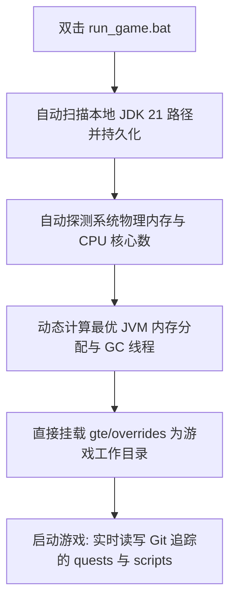

# 本地熱聯調與免啟動器快速執行

GTE 設計了一套對整合包策劃、任務編寫者與模組程式設計師極其友好的無感聯調系統。

---

## ⚡ 1. 免啟動器極速啟動指令碼 (`run_game.bat` / `run_game.sh`)

對於任務書作者（FTB Quests）和 KubeJS 配方策劃人員，**無需開啟 IntelliJ IDEA，也無需安裝任何第三方啟動器**，直接雙擊專案根目錄下的 **`run_game.bat`** 即可極速進入遊戲！



### 核心特性
1. **全自動 JDK 21 探測**：自動檢索 `.jdks`、`Adoptium`、`Zulu`、`Program Files` 下安裝的 Java 21，並自動記憶於 `.jdk_path`。
2. **硬體自適應最佳化**：根據當前電腦的 RAM 總量自動按最優比例（50%~60% 可用實體記憶體）分配 JVM 堆大小，自動配置並行 GC 執行緒。
3. **零挪動工作流**：遊戲內修改任務（`/ftbquests editing_mode true`）並儲存，修改直接實時儲存在 Git 倉庫對應的 `config/ftbquests/` 中，開啟 GitHub Desktop 即可一鍵提交！

---

## 🔗 2. 外部啟動器零複製對映工具 (`link_to_launcher.bat`)

如果你習慣使用自己配置好皮膚、按鍵習慣的啟動器（如 PCL2 / HMCL / Prism Launcher）：

1. 雙擊執行根目錄的 **`link_to_launcher.bat`**。
2. 按提示將你的啟動器遊戲目錄（例如 `D:\PCL2\.minecraft\versions\GTE-Dev\.minecraft\`）拖入控制檯中並回車。
3. 指令碼會自動建立 Windows 目錄軟連結 (Directory Junctions)：
   - `config` ➜ `gte/overrides/config`
   - `kubejs` ➜ `gte/overrides/kubejs`
   - `ftbquests` ➜ `gte/overrides/config/ftbquests`
   - `defaultconfigs` ➜ `gte/overrides/defaultconfigs`
4. 無論在啟動器中如何修改任務或配方，**物理資料實時同步儲存在主 Git 倉庫中**！

---

## ☕ 3. 模組程式碼熱編譯影子環境 (`gte-dev-runtime`)

對於 Java/Kotlin 程式設計師，`modules/gte-dev-runtime` 是專用的影子除錯模組：

### 工作原理與設計考量
- **定位**：純本地熱編譯聯調沙盒，**禁止打包釋出，不會出現在任何玩家構件中**。
- **ModDevGradle 動態重對映**：自動將 `gtm-reborn` 與 `gtecore` 的最新原始碼熱編譯並掛載進 Mojang 反混淆名稱空間。

### 正確的啟動方式

以下三種入口等價，且都會自動將遊戲視窗置頂：

```powershell
$env:JAVA_HOME='C:\Users\Ex_Je\.jdks\ms-21.0.11'
.\gradlew.bat runFullPack                          # preferred, root aggregate entry point
.\gradlew.bat :modules:gte-dev-runtime:runClient    # equivalent
.\run_game.bat                                     # same task, auto-detects JDK/RAM/cores
```

### 為什麼前 25 秒看不到視窗（這是正常的）

為規避 Embeddium/Oculus 在獨立顯示卡上的 GLFW 上下文死鎖，Forge 的早期進度視窗被刻意停用。代價是視窗要到 `Minecraft.<init>` 內部才會建立，而此時遊戲 JVM 已是由 Gradle 守護行程 fork 出來的背景行程。Windows 前台鎖會拒絕它的焦點請求，因此視窗確實已正確建立並正常渲染，卻被壓在當前活動視窗下方 —— 看起來就和「視窗根本沒有彈出」一模一樣。

因此 `runClient` 會非同步拉起 `scripts/dev/raise_game_window.ps1`。它會輪詢屬於本次執行自己 JVM 的 `GLFW30` 視窗，再用 `SetWindowPos` 把它提到最前（Z 序變更不受前台鎖限制，因此置頂必定成功）。其日誌位於 `modules/gte-dev-runtime/build/raise-game-window.log`。完整冷啟動約需 70 秒。

### 環境變數開關

| 環境變數 | 作用 |
| --- | --- |
| `GTE_WINDOW_WIDTH` / `GTE_WINDOW_HEIGHT` | 視窗尺寸（預設 1600x900） |
| `GTE_NO_WINDOW_RAISE=1` | 略過置頂，讓視窗保持在 GLFW 原本放置的位置 |
| `GTE_RUNTIME_XMX` | 客戶端堆上限（預設 `8G`） |

### 不要透過 `.vscode/launch.json` 啟動

`.vscode/launch.json` 中的配置是 ModDevGradle 在 IDE 同步期間自動產生的。它們直接呼叫 `net.neoforged.devlaunch.Main`，繞過 `runClient` 任務，因此視窗永遠不會被置頂 —— 而且該檔案在每次 IDE 同步時都會被重寫，手動修改無法保留。持久化的執行參數請寫在 `build.gradle` 的 `runs {}` 區塊中。

需要中斷點時，請使用 IntelliJ 的 `Run Client (Hot Debug)` 配置。它會掛載 JDWP 除錯器，並可能在退出時於 `run/client/` 留下 `hs_err_pid*.log` 檔案；那是已知的無害產物，與啟動流程無關。
