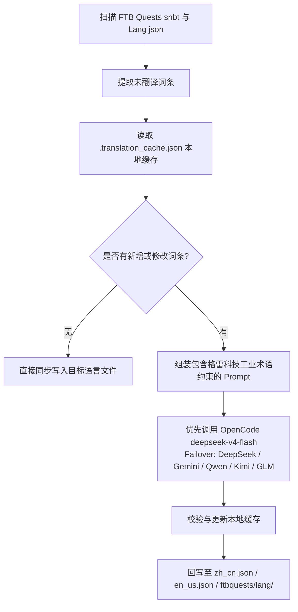

# AI 国际化翻译引擎 (`opencode_translate.py`)

GTE 工程实现了由统一脚本驱动的工业级多语言国际化翻译体系，覆盖 Mod 资产、FTB 任务书、Markdown 文档三大领域。

---

## 🔒 翻译五条铁律

本项目翻译工作遵循以下 **5 条不可违反的铁律**：

1. **单一脚本**：所有翻译唯一由 `scripts/opencode_translate.py` 驱动，接入 OpenCode Zen 的 `deepseek-v4-flash` 模型。禁止引入第二个翻译脚本或手动拼接 API 调用。
2. **云端执行**：所有全量翻译必须在 GitHub Actions CI 中运行（`translate.yml` / `docs-deploy.yml` / `sync-build.yml`），严禁在本地手动大规模执行。
3. **唯一定位**：全站统一部署到 `https://takanashisatou.github.io/GregtechEasy/`（`gh-pages` 分支），不搞第二个文档站，不重复部署。
4. **英文规则**：
   - 文档系统（`docs/en/`）：英文必须由 AI 全量翻译自 `docs/zh/`，禁止人工覆盖；
   - 模组工程：只有 `gtecore` 的 `en_us.json` 保持人工维护，脚本内置保护逻辑，绝不机翻覆盖。
5. **深度本地化**：导航菜单（`nav_translations`）、Mermaid 流程图文字、代码注释、表格标签必须 100% 对应语言本地化。

---

## 🤖 翻译引擎架构

传统的社区汉化依赖人工手动维护繁杂的 JSON 与 SNBT 文本，更新滞后且极易产生错漏。

GTE 的 AI 翻译引擎通过标准化 OpenAI 兼容 API，实现了 FTB Quests 任务书与核心 Mod 语言文件的**自动化增量提取、术语对齐与并发翻译**：

---

## 🔑 支持的 LLM 供应商与环境变量

脚本按以下优先级自动选取第一个可用的 API Key，无需手动指定提供商：

| 优先级 | 供应商名称 | API Key 环境变量 | Base URL 环境变量 | 默认模型 |
| :---: | :--- | :--- | :--- | :--- |
| **1（首选）** | **OpenCode Zen** | `OPENCODE_API_KEY` | `OPENCODE_BASE_URL` | **`deepseek-v4-flash`** |
| 2 | DeepSeek | `DEEPSEEK_API_KEY` | `DEEPSEEK_BASE_URL` | `deepseek-chat` |
| 3 | Google Gemini | `GEMINI_API_KEY` | `GEMINI_BASE_URL` | `gemini-3.6-flash` |
| 4 | 通义千问 (DashScope) | `DASHSCOPE_API_KEY` | `DASHSCOPE_BASE_URL` | `qwen-plus` |
| 5 | 月之暗面 (Moonshot) | `MOONSHOT_API_KEY` | `MOONSHOT_BASE_URL` | `moonshot-v1-8k` |
| 6 | 智谱清言 (Zhipu GLM) | `ZHIPU_API_KEY` | `ZHIPU_BASE_URL` | `glm-4-flash` |
| 7 | OpenAI | `OPENAI_API_KEY` | `OPENAI_BASE_URL` | `gpt-4o-mini` |
| 8 | 通用聚合代理 | `LLM_API_KEY` | `LLM_BASE_URL` | `LLM_MODEL`（自定义） |

> **注意**：仅需在 GitHub Secrets 中配置 `OPENCODE_API_KEY` 即可使 CI 完整运行。其余为备用 Failover。

---

## 🎯 工业级 Prompt 约束原则

在调用 API 进行翻译时，系统内置了严格的 Minecraft 与 GregTech 术语规则：

1. **格式符绝对保留**：完整保留 Minecraft 原生颜色格式化代码（如 `§a`, `§c`, `§6`）与占位符（`%s`, `%d`, `{0}`）。
2. **科技术语规范统一**：严格锁定科技专有名词翻译（如 `UHV`, `EU/t`, `Amps`, `Voltage`, `Overclock`, `Subtick` 等）。
3. **哈希增量缓存**：所有已翻译条目自动持久化记录在 `.translation_cache.json` 中，只有新增或变更文本会发起网络请求，极大节省 Token 开销与 CI 耗时。
4. **Mermaid 图表文字本地化**：流程图节点标签（如 `A[标签]`）翻译为目标语言，`graph TD`、`-->`、`subgraph` 等语法关键字保持不变。
5. **代码注释与表格标签**：代码块内的注释（`//` / `#`）及表格列标题全量本地化。

---

## 🏗️ 受保护的文件（不可机翻）

| 路径 | 保护原因 | 保护机制 |
| :--- | :--- | :--- |
| `modules/gtecore/src/main/resources/assets/gtecore/lang/en_us.json` | gtecore 英文翻译由作者人工维护 | 脚本检测 `is_gtecore` 标志，`en_us` 语言跳过覆写 |

---

## 💻 CI 触发方式（云端执行，铁律 2）

| 场景 | 工作流 | 触发方式 |
| :--- | :--- | :--- |
| 推送代码后自动全量构建 + 翻译 | `sync-build.yml` | Push to `main`/`master` 自动触发 |
| 文档变更后自动翻译 + 部署 | `docs-deploy.yml` | `docs/` 或 `mkdocs.yml` 变更时触发 |
| 手动全量模组资产翻译 | `translate.yml` | Actions 页面手动触发，可选 Provider 和语言 |
| 手动全量文档翻译 | `translate.yml` | 勾选 `translate_docs` 输入项 |

> [!CAUTION]
> 禁止在本地手动运行 `python scripts/opencode_translate.py` 进行大规模全量翻译。本地运行仅用于调试单文件或验证 API Key 连通性。
