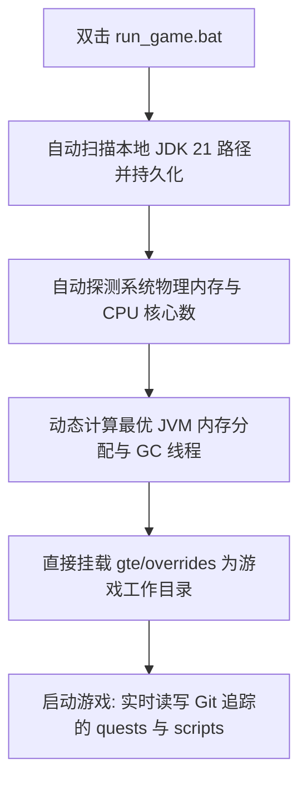
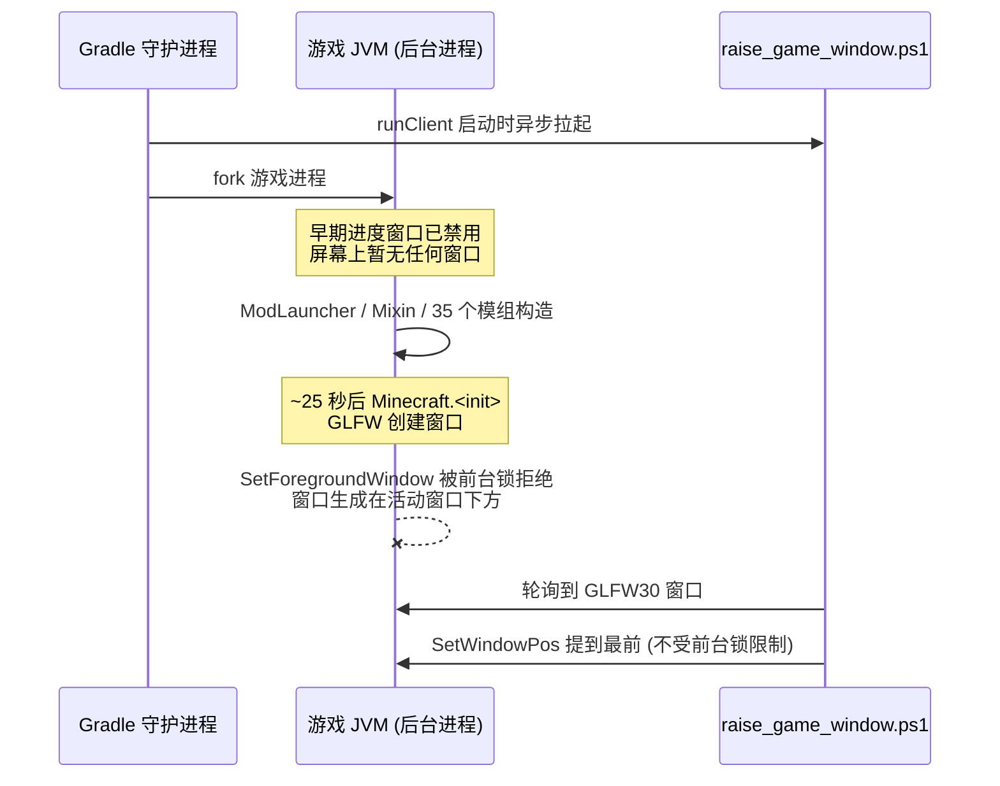

# 本地热联调与免启动器快速运行

GTE 设计了一套对整合包策划、任务编写者与模组程序员极其友好的无感联调系统。

---

## ⚡ 1. 免启动器极速启动脚本 (`run_game.bat` / `run_game.sh`)

对于任务书作者（FTB Quests）和 KubeJS 配方策划人员，**无需打开 IntelliJ IDEA，也无需安装任何第三方启动器**，直接双击项目根目录下的 **`run_game.bat`** 即可极速进入游戏！



### 核心特性
1. **全自动 JDK 21 探测**：自动检索 `.jdks`、`Adoptium`、`Zulu`、`Program Files` 下安装的 Java 21，并自动记忆于 `.jdk_path`。
2. **硬件自适应优化**：根据当前电脑的 RAM 总量自动按最优比例（50%~60% 可用物理内存）分配 JVM 堆大小，自动配置并行 GC 线程。
3. **零挪动工作流**：游戏内修改任务（`/ftbquests editing_mode true`）并保存，修改直接实时保存在 Git 仓库对应的 `config/ftbquests/` 中，打开 GitHub Desktop 即可一键提交！

---

## 🔗 2. 外部启动器零复制映射工具 (`link_to_launcher.bat`)

如果你习惯使用自己配置好皮肤、按键习惯的启动器（如 PCL2 / HMCL / Prism Launcher）：

1. 双击运行根目录的 **`link_to_launcher.bat`**。
2. 按提示将你的启动器游戏目录（例如 `D:\PCL2\.minecraft\versions\GTE-Dev\.minecraft\`）拖入控制台中并回车。
3. 脚本会自动建立 Windows 目录软链接 (Directory Junctions)：
   - `config` ➜ `gte/overrides/config`
   - `kubejs` ➜ `gte/overrides/kubejs`
   - `ftbquests` ➜ `gte/overrides/config/ftbquests`
   - `defaultconfigs` ➜ `gte/overrides/defaultconfigs`
4. 无论在启动器中如何修改任务或配方，**物理数据实时同步保存在主 Git 仓库中**！

---

## ☕ 3. 模组代码热编译影子环境 (`gte-dev-runtime`)

对于 Java/Kotlin 程序员，`modules/gte-dev-runtime` 是专用的影子调试模块：

### 工作原理与设计考量
- **定位**：纯本地热编译联调沙盒，**禁止打包发布，不会出现在任何玩家构件中**。
- **ModDevGradle 动态重映射**：自动将 `gtm-reborn` 与 `gtecore` 的最新源码热编译并挂载进 Mojang 反混淆命名空间。

### 正确的启动方式

以下三种入口等价，且都会自动置顶游戏窗口：

```powershell
$env:JAVA_HOME='C:\Users\Ex_Je\.jdks\ms-21.0.11'
.\gradlew.bat runFullPack                          # 推荐：根工程聚合入口
.\gradlew.bat :modules:gte-dev-runtime:runClient    # 等价写法
.\run_game.bat                                     # 同一任务，自动探测 JDK/内存/核心数
```

### 为什么启动后 25 秒看不到窗口（这是正常的）



为规避 Embeddium/Oculus 在独立显卡上的 GLFW 上下文死锁，Forge 的早期进度窗口被**刻意禁用**（详见[防崩溃手册](anti-crash-guide.md)）。代价是窗口要到 `Minecraft.<init>` 才创建，此时游戏进程已是 Gradle 守护进程派生的后台进程，Windows 前台锁会拒绝它抢占焦点 —— 窗口确实创建了、也在正常渲染，但被压在当前活动窗口下面，看起来就像"没弹出窗口"。

因此 `runClient` 会异步拉起 `scripts/dev/raise_game_window.ps1`，它轮询本次运行自己 JVM 的 `GLFW30` 窗口，再用 `SetWindowPos` 把它提到最前（Z 序变更不受前台锁限制，因此必定成功）。日志位于 `modules/gte-dev-runtime/build/raise-game-window.log`。完整冷启动约 70 秒。

### 环境变量开关

| 环境变量 | 作用 |
| --- | --- |
| `GTE_WINDOW_WIDTH` / `GTE_WINDOW_HEIGHT` | 窗口尺寸（默认 1600x900） |
| `GTE_NO_WINDOW_RAISE=1` | 关闭自动置顶，保持 GLFW 原始位置 |
| `GTE_RUNTIME_XMX` | 客户端堆上限（默认 `8G`，`run_game.bat` 会按物理内存自动设定） |

### ⚠️ 不要使用 `.vscode/launch.json` 启动

`.vscode/launch.json` 里的配置是 ModDevGradle 在 IDE 同步时自动生成的（分组名形如 `Mod Development - gte-dev-runtime`）。它们直接调用 `net.neoforged.devlaunch.Main`，**绕过 `runClient` 任务**，因此窗口不会被置顶；并且该文件每次 IDE 同步都会被重写，手工修改不会保留。持久化的运行参数请写在 `build.gradle` 的 `runs {}` 中 —— 两条路径读取的是同一份 `build/moddev/*RunProgramArgs.txt` 参数文件。

需要断点调试时使用 IDEA 的 **`Run Client (Hot Debug)`** 配置。它会挂载 JDWP 调试器，退出时可能在 `run/client/` 留下 `hs_err_pid*.log`（崩在 `jdwp.dll` 的 `Shutdown.halt0`），属已知的无害现象，与启动流程无关。

